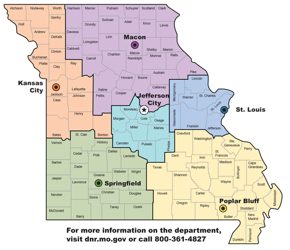

# About this book {#intro}

This book is an opinionated overview of the national and state parks as well as conservation areas visited by the authors. In order to be succinct, city and county parks are not included. All parks in included in this book will be categorized into the 6 regional areas, denoted by [DNR regional offices](https://dnr.mo.gov/regions/), that make up the state of Missouri. Each of those regions will be a chapter.  

1. Orange: West
2. Green: South
3. Purple: North
4. Light blue: Central
5. Yellow: Southeast
6. Blue: East

```{r, echo = FALSE, fig.align="center", out.width='50%'}

```


All parks are rated on 7 criteria using a 5 point system (1=lowest rating; 5=highest rating). This can help readers easily get a snapshot if the park is right for them. However, not everything can be summed up in a rating system so each park will also include further description of why those ratings were given as well as images of the park if one is available.


**Criterion used in rating system:**

|Criterion               |Description                                                         |
|------------------------|--------------------------------------------------------------------|
|Beauty                  |This includes natural beauty, cleanliness and uniqueness of the site|
|Uncrowded               |We prefer less crowds, so more crowded/popular equals lower rating  |
|Ease of navigation      |This refers to trail confusion, will you get lost IN the park       |
|Toddler friendly trails |Difficult terrain, poorly maintained trail, etc. equals low rating  |
|Dogs allowed            |Are dogs legally allowed in the park? Is it dog friendly?           |
|Camping options         |Are there options for car or primitive camping? Yurts/cabins?       |
|Activity options        |Do they rent kayaks? Have swimming, fishing, climbing, etc.?        |


