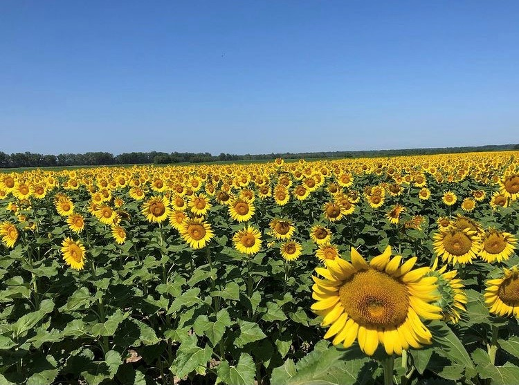

# East {#east}

<style>
.html-widget {
    margin: auto;
}
</style>

```{r, message=FALSE, warning=FALSE, echo=FALSE, fig.height=3, fig.align="center"}

library(tidyverse)
library(leaflet)

leaflet() %>%
  addTiles() %>%  # Add default OpenStreetMap map tiles
  addMarkers(lng=-90.1842, lat=38.8108,popup="Columbia Bottom Conservation Area") %>%
  addMarkers(lng=-90.824, lat=38.4821,popup="Shaw Nature Reserve")

# anchor_sections: FALSE

```


## Columbia Bottom Conservation Area 



Columbia Bottom Conservation Area is 4,316 acres of open space, most notably known for their sunflower fields that bloom during the summer months. From early July to late August people from all over visit this area walk around in awe of the vast sunflower fields. You are hard-pressed to find someone without a camera in their hands taking selfies or family photos. You can walk in the fields (there are usually at least 3 distinct fields of sunflowers) and there is also an observation platform to view them from above. It's quite beautiful, but can also be crowded and very hot during July and August. Be prepared to drive down a gravel road for several minutes to find each of the sunflower fields. The first one you come across is usually the busiest so if you want to avoid crowds, drive a little further to find the lesser known fields. 

This conservation area is also located at the Confluence of the Mississippi and Missouri rivers and has a very pretty sandy beach for lounging and fishing. Dogs would enjoy splashing around here as well. There are several trails including a stroller friendly paved trail that starts at the visitor center (although it is ~5 miles long and you will most likely only walk a portion before turning around). Last, in addition to hiking and fishing, other activities encouraged here include biking and hunting. One thing to note about this area is that it is very susceptible to flooding so check the website before visiting to make sure the park is open and accessible.

|Criterion           |Rating:|
|--------------------|-------|
|Beauty              |3    |
|Uncrowded           |2    |
|Ease of navigation  |4    |
|Toddler friendly    |4    |
|Dog friendly        |5    |
|Camping options     |1    |
|Activity options    |5    |


## Shaw Nature Reserve

|Criterion           |Rating:|
|--------------------|-------|
|Beauty              |5    |
|Uncrowded           |3    |
|Ease of navigation  |4    |
|Toddler friendly    |5    |
|Dogs friendly       |1    |
|Camping options     |1    |
|Activity options    |1    |


## Mastadon State Park

|Criterion           |Rating:|
|--------------------|-------|
|Beauty              |3    |
|Uncrowded           |3    |
|Ease of navigation  |2    |
|Toddler friendly    |3    |
|Dogs friendly       |4    |
|Camping options     |3    |
|Activity options    |3    |


## Don Robinson State Park

|Criterion           |Rating:|
|--------------------|-------|
|Beauty              |5    |
|Uncrowded           |3    |
|Ease of navigation  |3    |
|Toddler friendly    |2    |
|Dogs friendly       |4    |
|Camping options     |1    |
|Activity options    |1    |


## Sandy Creek Bridge Historic Site

|Criterion           |Rating:|
|--------------------|-------|
|Beauty              |4    |
|Uncrowded           |4    |
|Ease of navigation  |5    |
|Toddler friendly    |5    |
|Dogs friendly       |3    |
|Camping options     |1    |
|Activity options    |1    |